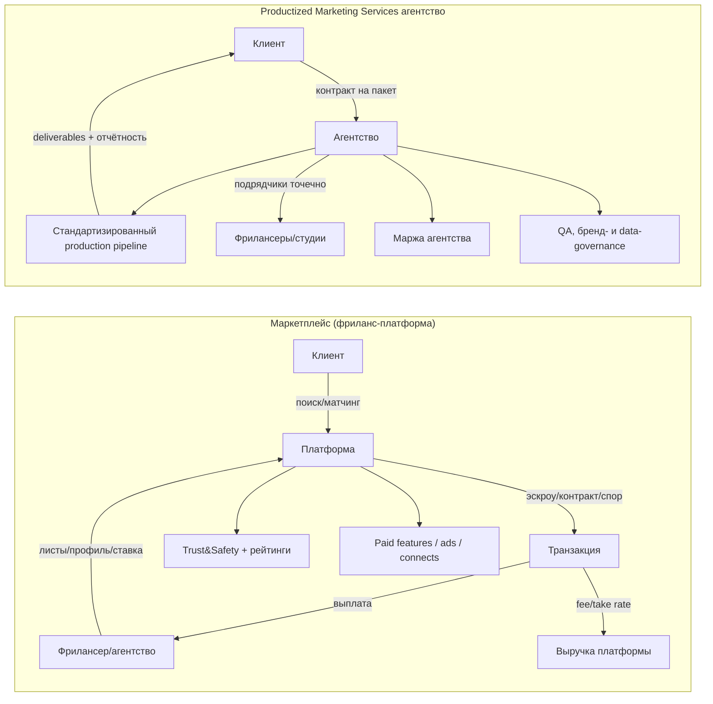
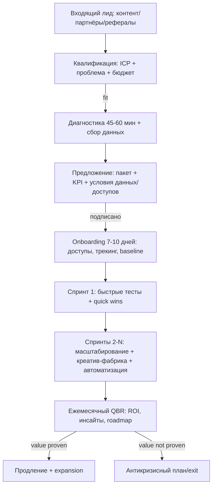

# Текущее состояние digital marketing и фриланс‑маркетплейсов в 2026 году: финансы, прогнозы с учётом ИИ и решение о запуске Productized Marketing Services

## Резюме для руководителя

К 2026 году сектор онлайн‑маркетплейсов услуг (фриланс/контрактинг) входит в фазу «взросления»: темпы роста замедляются, публичные игроки форсируют прибыльность, усиливают монетизацию (take rate) и двигаются «вверх по рынку» в сторону более сложных и дорогих проектов, корпоративных клиентов и управляемых услуг. Это видно по траекториям Fiverr и Upwork: у обоих рост выручки сочетается со снижением/стагнацией «непремиальной» базы клиентов и ростом среднего чека (spend per buyer / GSV per client), а также ростом маржинальности и денежного потока. citeturn38view1turn11view1turn11view4

Параллельно ИИ оказывает двусторонний эффект: (1) **субституция** — простые и повторяемые задачи дешевеют, часть спроса уходит «в самообслуживание» (генерация текста, графики, базового кода); (2) **аугментация** — спрос смещается в сторону интеграции ИИ в процессы, креативного контроля качества, сложной системной маркетинговой работы, аналитики, автоматизации и «оркестрации» команд/агентов. Upwork публично фиксирует всплеск спроса на AI‑skills (в т.ч. кратный рост по отдельным направлениям) и одновременно описывает ситуацию как «человеко‑ИИ коллаборацию», а не тотальную замену людей. citeturn37search10turn37news40

Для вашего решения «делать ли Productized Marketing Services агентство» ключевой вывод такой: **делать — да, но только в AI‑native конфигурации и с чёткой дифференциацией от “коммодити‑услуг”**. Маркетинговые бюджеты у многих компаний не растут пропорционально ожиданиям (у Gartner — «плоские» бюджеты как доля выручки), поэтому выигрывать будут модели, которые одновременно дают: (а) измеримый результат/эффективность, (б) скорость и производительность через ИИ, (в) доверие/качество/бренд‑безопасность. citeturn36search1turn36search3turn37news42

Рекомендованная конфигурация: **hybrid‑productized агентство** (стандартизированная «фабрика» поставки + сильный слой стратегии/моделирования/аналитики + строгий QA и governance ИИ‑контента) с фокусом на сегменты, где LTV высок и цена ошибки велика (B2B SaaS, fintech, health, complex e‑commerce, professional services). На маркетплейсы фриланса стоит смотреть как на **резерв мощности** (специалисты «точечно»), но не как на ядро позиционирования, иначе вы попадёте в ценовое давление «низа» рынка. Этот совет согласуется с тем, как сами маркетплейсы «перепрошиваются» под high‑value work и managed services. citeturn38view1turn11view1

Ниже — подробные финансовые метрики, рынок и прогнозы, влияние ИИ на экономику платформ и практическая 3‑летняя модель для productized‑агентства.

## Финансовое состояние и KPI маркетплейсов

### Снимок ключевых метрик по платформам

Таблица ниже объединяет **последние доступные публичные данные** по запрошенным платформам. Важно: определения метрик у компаний различаются (GMV/GSV, «marketplace revenue» vs «services revenue», «take rate» по сегменту и т.д.), поэтому сопоставления нужно читать вместе с примечаниями. citeturn16view0turn11view1turn38view2turn34view2

| Платформа / период | Выручка | GMV / GSV (объём транзакций) | Take rate | Валовая маржа | Adjusted EBITDA | Net income | Активная база | ARPU / средний чек | Что заметно по тренду |
|---|---:|---:|---:|---:|---:|---:|---|---:|---|
| Fiverr (FY2025) | $430.9m citeturn16view0 | **≈$1,074.0m GMV (расчётно)** citeturn16view0turn3view2 | 27.7% citeturn38view1 | 81.6% (GAAP) citeturn16view0 | $91.6m (21.3%) citeturn16view0 | $21.0m (GAAP) citeturn16view0 | 3.1m annual active buyers citeturn38view1 | ~$139/buyer/year (выручка/покупатель) citeturn38view1 | Покупателей меньше (‑13.6% YoY), но чек выше (spend/buyer +13.3%); marketplace‑выручка слегка снизилась, services‑выручка выросла +50.9% YoY citeturn16view0 |
| Upwork (FY2025) | $787.8m citeturn11view1 | $4.028b GSV citeturn11view1 | 18.7% (Marketplace) citeturn11view1 | 78% citeturn11view4 | $225.6m (adj) citeturn11view1 | $115.4m citeturn11view4 | 785k active clients citeturn11view1 | ~$1,004/client/year; GSV/client $5,129 citeturn11view1 | Клиентов меньше (‑6% YoY), но GSV на клиента выше (+6.5%); take rate растёт (18.0%→18.7%), прибыльность резко лучше citeturn11view1 |
| Freelancer Limited (1H25) | $28.0m (полугодие) citeturn38view2 | $439.0m GMV (полугодие) citeturn38view2 | ~6.4% (proxy: revenue/GMV) citeturn38view2 | 85.3% citeturn38view2 | не раскрыто в этом документе | $1.9m NPAT (полугодие) citeturn38view2 | 80m+ registered users citeturn38view2 | — | «Три бизнеса» (Freelancer + Escrow.com + Loadshift) и «лёгкая» прибыльность после оптимизаций; GMV во многом из escrow‑платежей citeturn38view2 |
| PeoplePerHour (UK filing, FY2024) | **не раскрыто** (малое предприятие, P&L не подан) citeturn34view2 | не раскрыто | не раскрыто | не раскрыто | не раскрыто | не раскрыто | среднесписочная численность 4 citeturn34view4 | — | По балансу: cash £923k; net assets £5k; резкое изменение «profit and loss account» между 2023 и 2024 — без пояснений в этих сокращённых отчётах citeturn34view2turn34view4 |

**Пояснение по расчётному GMV Fiverr.** Компания определяет marketplace take rate как отношение marketplace revenue к marketplace GMV. citeturn3view2 Поэтому если дан marketplace revenue ($297.5m) и take rate (27.7%), GMV можно восстановить как revenue/take rate ≈ $1.074b. Это **вычисление**, а не отдельная публикация GMV в пресс‑релизе. citeturn16view0turn3view2

### Fiverr: рост выручки при падении базы покупателей и переходе к «высокому чеку»

**Ключевые финансовые факты FY2025:**
- Выручка $430.9m (+10.1% YoY), при этом marketplace revenue $297.5m (‑1.8% YoY) и services revenue $133.4m (+50.9% YoY). citeturn16view0  
- GAAP gross margin 81.6%; Adjusted EBITDA $91.6m (margin 21.3%). citeturn16view0  
- GAAP net income $21.0m; free cash flow $103.3m. citeturn16view0  
- Annual active buyers 3.1m (‑13.6% YoY), annual spend per buyer $342 (+13.3% YoY); take rate 27.7% (на +10 bps). citeturn38view1turn16view0  

**Интерпретация.** Сочетание падающей базы покупателей и растущего spend/buyer — типичный признак «ап‑маркет» стратегии: платформа «выдавливает» низкий сегмент и пытается удержать/нарастить объём за счёт более дорогих проектов и более платёжеспособных клиентов. Это подтверждается упором на high‑value проекты (в пресс‑релизе прямо отмечается рост GMV в транзакциях >$1,000 и рост числа покупателей >$10,000/год). citeturn16view0

**Риск‑сигнал на 2026.** В официальном прогнозе на FY2026 компания закладывает выручку $380–$420m (то есть диапазон включает падение год‑к‑году) и Adjusted EBITDA $60–$80m на фоне трансформации и инвестиций. citeturn16view0 Это важно: даже при сильной экономике модели (gross margin 80%+) рынок «перенастраивается» из‑за ИИ и макроусловий — и платформа сама предупреждает о волатильности и сознательном «deprioritize» низкого сегмента. citeturn16view0

### Upwork: прибыльность растёт быстрее выручки, take rate усиливается, клиентская база сжимается

**Ключевые факты FY2025 (в сравнении с FY2024):**
- Выручка $787.8m (+2.4% YoY), GSV $4.028b (+0.5% YoY). citeturn11view1  
- Marketplace revenue $682.9m (+3.1% YoY) и marketplace take rate 18.7% (против 18.0%). citeturn11view1  
- Active clients 785k (против 832k), но GSV per active client вырос до $5,129 (против $4,815). citeturn11view1  
- Валовая маржа 78%; net income $115.4m (после $215.6m годом ранее) и adjusted EBITDA $225.6m (после $167.6m). citeturn11view4turn11view1  
- Sales & marketing expense снижается: $143.4m в 2025 против $185.2m в 2024 (‑22.6%); это уменьшает «маркетинговую нагрузку» на активного клиента примерно с ~$223 до ~$183 в год (прокси‑метрика, не «чистый CAC»). citeturn11view5turn11view1  

**География спроса и предложения (важно для прогнозов).** В 2025 около 71% GSV генерируется клиентами из США (в 2024 — ~70%, в 2023 — ~69%); при этом база талантов существенно более распределена глобально, а доля США в таланте ~25% GSV. citeturn38view0 Это не просто «описание»: такая структура делает платформу чувствительной к циклу IT/маркетинг‑бюджетов США, но позволяет «дешёвое глобальное предложение» подпитывать маржу.

**Интерпретация.** Upwork демонстрирует профиль зрелого маркетплейса: рост выручки не взрывной, но платформа «дожимает» экономику за счёт:
- увеличения take rate на marketplace, citeturn11view1  
- роста spend на активного клиента, citeturn11view1  
- оптимизации sales & marketing. citeturn11view5  

Для вас это сигнал, что «просто быть посредником между клиентом и фрилансером» становится недостаточно — выигрывают модели, которые умеют монетизировать доверие, качество, compliance, enterprise‑функции и managed workflows.

### Freelancer.com и PeoplePerHour: публичность/метрики ограничены, модели неоднородны

**Freelancer.com (через публичную компанию Freelancer Limited).** Доступная последняя «глубокая» метрика в нашем наборе — 1H25 бизнес‑апдейт: GMV $439m и выручка $28m за полугодие, валовая маржа 85.3%, прибыль $1.9m. citeturn38view2 Но структура GMV сильно зависит от Escrow.com (крупные «платёжные» объёмы с иной экономикой), поэтому сравнивать «take rate» с Fiverr/Upwork напрямую некорректно без сегментного разреза. citeturn38view2 Для контекста: по FY24 компания сообщала group GMV $948.6m и group revenue $53.1m (что подтверждает «низкий» агрегированный take rate на уровне группы). citeturn18search8turn17search5

**PeoplePerHour.** Через Companies House доступны сокращённые отчёты People Per Hour Ltd, но компания использует режим малых предприятий и **не публикует P&L (выручка/маржа/прибыль не видны)**. citeturn34view2turn32view0 Из объективно доступного: на 31.12.2024 cash ~£923k, дебиторка ~£864k, краткосрочные обязательства ~£1.832m, численность (average) 4 человека. citeturn34view2turn34view4

## Размер рынка и прогнозы роста

### Почему «размер рынка» даёт разные цифры

В индустрии одновременно используются несколько «рынков», которые легко перепутать:
- **Total advertising / media ad spend** (вся реклама всех типов).  
- **Digital advertising** (цифровая реклама как часть total).  
- **Digital advertising & marketing** (часто шире, включает performance‑инструменты, площадки, сервисы). citeturn36search22  
- **Freelance platforms market** (обычно — выручка платформ, а не GMV). citeturn31search29turn2search1  
- **Online labour / gig economy** (может измеряться как число занятых, как доходы работников или как транзакционный объём). citeturn37search5turn37search1  

Поэтому в отчёте ниже я:
1) фиксирую **якорные точки** из конкретных источников,  
2) делаю **расчётные таймлайны** только там, где источник даёт CAGR и конечные точки (и явно помечаю это как расчёт).

### Digital marketing: бюджеты не «раздуваются», но структура смещается в цифровые каналы и ИИ‑рекламу

**Бюджеты маркетинга как доля выручки компаний.** По данным Gartner, в 2025 маркетинговые бюджеты остаются на уровне 7.7% выручки компаний (flat YoY). citeturn36search1 Для стратегии productized‑агентства это означает: клиентам нужно либо (а) больше результата за те же деньги, либо (б) быстрый ROI/доказуемый инкремент — иначе бюджеты не «разблокируются».

**Глобальная реклама (total).** Оценки total ad market на 2025–2026 у разных прогнозистов близки по духу (рост сохраняется, но без «перегрева»). Например, WPP Media прогнозировала рост глобальной рекламной выручки на 6% в 2025 до ~$1.15T, при этом доля digital в 2025 оценивается ~73.2%. citeturn2search10turn1search2 WARC отдельно прогнозировала рост global ad spend до ~$1.23T в 2025 и ~$1.27T в 2026. citeturn1search0turn1search1

**Доля digital продолжит расти.** Reuters пересказывает прогноз PwC: digital ad formats были ~72% total ad revenue в 2024 и могут вырасти до ~80% к 2029, при этом драйвером называются AI‑powered ads и новые форматы вроде connected TV. citeturn36news41turn36search6

### Два расчётных таймлайна роста рынка

Ниже — **таймлайн** (2021–2031) по двум рынкам на основе отчётов Research and Markets. Обе линии — **расчёт по CAGR/конечным точкам**, а не «помесячный факт». Это полезно, чтобы увидеть порядок величин и относительную скорость роста, но не заменяет полноценный платный dataset. citeturn36search22turn31search29

| Год | Digital advertising & marketing, $B (расчёт по CAGR 11% от 2024) | Freelance platforms, $B (расчёт по 2024→2030) |
|---:|---:|---:|
| 2021 | 435.1 | 3.57 |
| 2022 | 482.9 | 4.15 |
| 2023 | 536.0 | 4.82 |
| 2024 | **595.0 (якорь)** citeturn36search22 | **5.60 (якорь)** citeturn31search29 |
| 2025 | 660.5 | 6.51 |
| 2026 | **733.1 (текущий год, расчёт)** | **7.56 (текущий год, расчёт)** |
| 2027 | 813.7 | 8.79 |
| 2028 | 903.3 | 10.22 |
| 2029 | 1002.6 | 11.87 |
| 2030 | **1112.9 (≈$1.1T, совпадает с прогнозом)** citeturn36search22 | **13.80 (якорь)** citeturn31search29 |
| 2031 | 1235.3 | 16.04 |

**Как читать эти числа:**
- Research and Markets для **Digital Advertising and Marketing** даёт $595B в 2024 и $1.1T к 2030 при CAGR ~11%. citeturn36search22  
- Для **Freelance Platforms** (как рынка платформ) в цитируемом обзоре указано $5.6B в 2024 и $13.8B к 2030. citeturn31search29  
- Промежуточные годы — интерполяция CAGR.  

### Сегментация спроса: тип услуг, география, SMB vs enterprise

**Типы услуг (marketing/dev/design/writing).** По данным, которые entity["organization","International Labour Organization","un agency"] обсуждает на базе онлайн‑данных, крупнейшая категория онлайн‑фриланс‑задач глобально — software development & technology; её доля увеличилась с 39% в 2018 до 45% в 2020. citeturn37search21turn37search1 Это автоматически означает: «маркетинг‑услуги» на маркетплейсах присутствуют, но структурно конкурируют с крупнейшим “tech‑пулом”, и в периоды, когда IT‑бюджеты проседают, платформы ощущают давление.

На уровне отдельных региональных исследований картина может отличаться: например, в обзоре по онлайн‑гига‑работе в Индии и Индонезии отмечается рост долей software development, creative/multimedia и sales/marketing, при падении writing/translation. citeturn37search8 Это поддерживает тезис о смещении к более «инструментальным» и «интеграционным» навыкам.

**География.** Для глобальной платформенной экономики важна не только «где клиенты», но и «где талант». Upwork публикует, что США дают ~71% GSV со стороны клиентов, тогда как талант распределён шире (США ~25% GSV со стороны таланта; далее — Индия и Филиппины). citeturn38view0 Вывод практический: если ваш продукт‑маркетинговый сервис ориентирован глобально, то **платёжеспособный спрос** чаще будет тяготеть к США/западным рынкам, а **поставку** можно гибко строить через распределённую команду — при условии жёсткого QA.

**SMB vs enterprise.** Upwork прямо описывает диапазон клиентов от малого бизнеса до Fortune 100 и выделяет отдельные решения для enterprise (в т.ч. контрактинг/управление). citeturn38view0 Fiverr в описании «About» также позиционируется как платформа от малого бизнеса до Fortune 500. citeturn16view0 Это важно для вашей стратегии: enterprise‑сегмент приносит более длинный LTV, но требует compliance, процессов, безопасности данных и часто «управляемой поставки» вместо чистого маркетплейса.

## Влияние ИИ: субституция спроса, аугментация, давление на цены и новая экономика качества

### Что ИИ делает со спросом на фриланс и digital‑маркетинг

**Маркетинг как функция — гигантский “пул эффективности”.** entity["company","McKinsey & Company","management consulting"] оценивает, что generative AI может увеличить продуктивность маркетинга на 5–15% от total marketing spend, что эквивалентно примерно $463B ежегодной «стоимости потенциала». citeturn36search3turn36search31 На практике это означает:
- часть работ станет **дешевле** (copy/вариации креатива/черновая аналитика),
- возрастёт спрос на тех, кто умеет «превращать productivity в performance» (эксперименты, инкрементальность, атрибуция, рост конверсии).

**Доказательная практика в компаниях.** Reuters описывает кейс entity["company","IBM","technology company"], где использование генеративных инструментов entity["company","Adobe","software company"] в маркетинговом дизайне сократило turnaround time с ~2 недель до ~2 дней. citeturn37news41 Это классический “throughput shock”: команда не исчезает, но производит больше артефактов быстрее — значит базовые операции дешевеют, а ценность смещается к стратегии и качеству.

**На маркетплейсах растёт спрос на AI‑навыки.** Upwork в отчётах по востребованным навыкам фиксирует, что AI‑skills растут быстро; в релизе 2026 года говорится, что спрос на top AI skills более чем удвоился, а по отдельным направлениям (например, AI video generation & editing, AI integration) заявляются кратные темпы роста. citeturn37search10turn37search14

**Но “замена людей” пока точечная.** entity["organization","Axios","news outlet"] со ссылкой на исследование Upwork подчёркивает: субституция реальна, но узкая — ИИ замещает низкосложные повторяемые задачи, тогда как комплексные проекты и роли «интеграторов» остаются востребованными; при этом доходы по AI‑работам выросли на 25% год‑к‑году. citeturn37news40

### Давление на цены и “workslop”: почему качество становится товаром с премией

Один из главных эффектов массового генИИ в маркетинге — **переизбыток низкокачественного контента** (в англоязычной прессе это называют “AI‑slop/workslop”). Это приводит к тому, что у компаний появляется новый класс затрат: «починить то, что нагенерировали» — редактура, факт‑чекинг, правка креатива, бренд‑контроль. citeturn37news42 Следствие для экономики услуг:
- нижний сегмент (дешёвый копирайт/дешёвые баннеры/простые лендинги) испытывает **ценовое давление**;
- премиальный сегмент (бренд, офферы, креативная стратегия, ростовая аналитика, системная воронка) получает **ценовую премию** за «гарантию качества и результата».

Это напрямую влияет на маркетплейсы: им приходится инвестировать в trust & safety, качества матчинг, managed services и «AI‑native» продукты, иначе часть спроса уходит мимо платформ. Fiverr прямо говорит о «трансформации» и переходе к AI‑native capabilities и high‑value work (с признанием волатильности в 2026). citeturn16view0

### Как ИИ повлияет на экономику платформ

С точки зрения P&L маркетплейсов ключевые «рычаги» выглядят так:

1) **Спрос (GMV/GSV):**  
   - низкосложные категории могут падать/дешеветь,  
   - сложные категории растут; средний чек растёт даже при падении числа покупателей/клиентов (что наблюдается у Fiverr и Upwork). citeturn38view1turn11view1  

2) **Take rate:**  
   - платформы пытаются поднять take rate через value‑added services (в т.ч. «connects», рекламу, managed services, payments). Upwork показывает рост marketplace take rate (18.0%→18.7%). citeturn11view1  

3) **Маржинальность:**  
   - при росте доли управляемых/сервисных продуктов может меняться gross margin (обычно вниз из‑за сервисной составляющей), но «правильная» операционная модель способна компенсировать это снижением S&M и оптимизацией затрат. citeturn16view0turn11view5  

4) **Качество/комплаенс как продукт:**  
   - enterprise‑покупатели будут платить за безопасность данных, юридическое оформление, SLA, governance ИИ‑контента, что ближе к «агентству/интегратору», чем к классическому маркетплейсу. citeturn38view0turn16view0  

## Сравнение моделей: маркетплейс vs Productized Marketing Services агентство

### Экономика и масштабирование: что реально сравнивать

Маркетплейс и productized‑агентство — это разные типы бизнеса:

- Маркетплейс монетизирует **транзакционный поток** (GMV/GSV) через take rate и сервисные комиссии, инвестируя в ликвидность, доверие и продукт. Высокая валовая маржа (часто 70–85%) — типична (например, Fiverr ~82% GAAP gross margin; Upwork ~78%). citeturn16view0turn11view4  
- Productized‑агентство монетизирует **результат и процесс поставки**; валовая маржа зависит от доли подрядчиков и эффективности «фабрики». При грамотной стандартизации и ИИ‑аугментации валовая маржа 55–75% достижима у сервисных компаний, но рост упирается в операционку (люди, QA, управление ожиданиями). (Это — вывод на базе практики сервисных моделей; в источниках ниже он не «публикуется как факт», поэтому используйте как рабочую гипотезу.)

### Схема сравнения бизнес‑моделей (Mermaid)



### Практическое сравнение по ключевым параметрам

**Unit economics и маржа.**  
Маркетплейс масштабируется «тонким слоем» софта (при удаче), но требует больших вложений в продукт, risk‑контур и комплаенс. Агентство масштабируется медленнее, зато может быть прибыльным раньше и контролировать качество end‑to‑end.

**Customer acquisition (CAC) и удержание (LTV).**  
У маркетплейса CAC часто становится дороже при насыщении рынка, но удержание поддерживается сетевыми эффектами (если они сильны). В цифрах это обычно выражается не прямым CAC, а «издержками на S&M» и динамикой активной базы. Upwork, например, снижает S&M при падающей активной базе клиентов и растущем GSV на клиента — типичный паттерн зрелой монетизации. citeturn11view5turn11view1  
У productized‑агентства LTV управляется через: нишу, качество результата, KPI‑контур, договорные минимумы и рост «доли кошелька» клиента.

**Операционная сложность.**  
- Маркетплейс: fraud, споры, безопасность платежей, системные риски, регуляторика, качество матчинг/рейтингов.  
- Агентство: бóльшая ответственность за результат, управление ожиданиями, «люди‑процессы‑качество», интеграция с данными клиента, риски зависимости от пары каналов (Google/Meta и т.п.).  
ИИ усиливает обе сложности: маркетплейсу нужны AI‑native trust signals, агентству — AI‑governance и контроль “workslop”. citeturn16view0turn37news42

## Рекомендации: go/no-go, модель, GTM, AI‑интеграция, риски и 3‑летний сценарий

### Go / No‑Go

**Go**, при соблюдении трёх условий:

1) **Не конкурировать с “низом” рынка** (простые SMM‑посты, «копирайт за $50», базовый монтаж) — там ИИ и маркетплейсы давят цену, а качество становится проблемой. citeturn37news42turn37news40  
2) **Продавать измеримый бизнес‑результат**, а не «часы/таски» (иначе вы попадаете в ценовую конкуренцию с платформами и AI‑самообслуживанием).  
3) **Сделать AI‑native производственный контур**, где ИИ — ускоритель, но качество и ответственность закреплены «человеческим» QA и методологией (иначе вы будете производить то же “workslop”, что рынок уже начинает отторгать). citeturn36search3turn37news42  

### Рекомендуемая бизнес‑модель productized‑агентства

**Формат**: «пакет + SLA + KPI‑контур + опциональная success‑компонента».

- **Core‑ретейнер (productized tiers)**:  
  - *Launch* (для SMB): аудит + настройка аналитики + 1–2 канала acquisition + базовая креатив‑линия.  
  - *Growth* (для scale‑ups): мультиканал + эксперименты + креатив‑фабрика + CRM/lifecycle связка.  
  - *Scale/Enterprise‑ready*: governance, согласованные эксперименты, атрибуция, безопасность данных, документированный процесс.

- **Опционально**: performance fee от инкрементальной прибыли/выручки, но только там, где можно договориться про измерение (иначе конфликт и “blame game”).

- **Поставка**: ядро in‑house (стратегия, аналитика, QA, клиентский успех), «хвост» через фриланс‑рынок для пиков/нишевых задач. Эта архитектура использует маркетплейсы как supply chain, а не как конкурента.

### GTM: как привлечь клиентов в мире, где бюджеты плоские

Так как маркетинг‑бюджеты у многих компаний «застыли» на ~7.7% выручки, выигрывает не «самое креативное обещание», а **самая убедительная экономика**. citeturn36search1

Реалистичная GTM‑логика:

- **Узкий ICP на старте**: 1–2 вертикали, где вы понимаете юнит‑экономику и можете быстро показать lift (например: B2B SaaS с высоким gross margin; e‑commerce с повторными покупками; сервисы с высоким LTV).  
- **«Wedge‑offer»**: продукт, который за 2–4 недели создаёт денежный эффект или экономию времени. Пример: «AI‑augmented creative + paid social testing sprint», где вы обещаете (а) уменьшение CPM/CAC, (б) рост CVR, (в) скорость тестов.  
- **Доказательство “speed x quality”**: кейсы, бенчмарки, прозрачная методология. Кейсы типа IBM/Adobe (2 недели → 2 дня) показывают, что скорость стала понятной ценностью — и вы должны уметь приземлить это на KPI клиента. citeturn37news41  

### AI‑интеграция: где ИИ даёт преимущество агентству, а где создаёт риск

ИИ имеет смысл “вшивать” в 4 слоя:

1) **Research & strategy acceleration** (быстрее инсайты/варианты гипотез, но финальные решения — человеком).  
2) **Creative factory** (варианты креатива/копи, но с человеческим бренд‑контролем).  
3) **Ops automation** (брифы, чек‑листы, отчёты, напоминания, полуавтоматические QA‑проверки).  
4) **Measurement & experimentation** (помощь в планировании тестов, анализе сегментов, но критичные выводы — через статистический и бизнес‑контекст).

Параллельно нужен «контур безопасности»: запрет на загрузку чувствительных данных в неподходящие инструменты, правила авторских прав/лицензий, журналирование промптов для воспроизводимости, чек‑лист факт‑чекинга. Рост “workslop” показывает, что рынок начинает штрафовать тех, кто использует ИИ без контроля качества. citeturn37news42

### Риски и план снижения рисков

**Риск ценовой эрозии (коммодитизация).**  
Митигация: продавать «результат и систему», а не «контент/объявления». Упаковывать в продукт со стандартом качества и SLA.

**Риск зависимости от каналов (платформенные правила, аукцион, трекинг).**  
Митигация: диверсификация каналов, упор на first‑party data и lifecycle, тестирование новых форматов (CTV/streaming, AI‑персонализация) — что согласуется с прогнозами PwC о росте digital и AI‑ads. citeturn36news41

**Риск “AI‑качество/репутация”.**  
Митигация: QA‑процесс, человеческая редактура, контроль фактов и бренда; продавать это как часть продукта (trust‑layer).

**Риск “маркетплейсы съедят”.**  
Митигация: маркетплейс — это supply, а вы — «операционная система маркетинга клиента». Публичные данные показывают, что сами платформы пытаются стать ближе к managed services; значит, дифференцироваться нужно через отраслевую экспертизу, метрики и ответственность. citeturn16view0turn38view0

### 3‑летний сценарный план (консервативный / базовый / оптимистичный)

Ниже — **прикладная финансовая модель** productized‑агентства на 2026–2028 (USD). Это **не прогноз рынка**, а управленческая модель с явными допущениями: линейный рост клиентской базы, фиксированный ARPA, разная динамика валовой маржи и OPEX‑доли по мере стандартизации и AI‑аугментации.

| Сценарий | Год | Клиенты (конец) | Клиенты (среднее) | ARPA, $/мес | Выручка, $m | Валовая прибыль, $m | EBITDA, $m | EBITDA маржа |
|---|---:|---:|---:|---:|---:|---:|---:|---:|
| Консервативный | 2026 | 8 | 4.0 | 3,500 | 0.18 | 0.09 | 0.00 | 2% |
| Консервативный | 2027 | 14 | 11.0 | 3,500 | 0.47 | 0.26 | 0.05 | 10% |
| Консервативный | 2028 | 20 | 17.0 | 3,500 | 0.73 | 0.44 | 0.13 | 18% |
| Базовый | 2026 | 12 | 6.0 | 6,000 | 0.47 | 0.28 | 0.07 | 15% |
| Базовый | 2027 | 24 | 18.0 | 6,000 | 1.33 | 0.87 | 0.33 | 25% |
| Базовый | 2028 | 36 | 30.0 | 6,000 | 2.20 | 1.54 | 0.77 | 35% |
| Оптимистичный | 2026 | 18 | 9.0 | 9,000 | 1.04 | 0.68 | 0.24 | 23% |
| Оптимистичный | 2027 | 36 | 27.0 | 9,000 | 2.99 | 2.09 | 1.02 | 34% |
| Оптимистичный | 2028 | 54 | 45.0 | 9,000 | 4.93 | 3.70 | 2.22 | 45% |

**Что обязательно нужно измерять (чтобы эта модель стала реальностью):**
- gross margin по каждому пакету (и по каждому типу задач),
- retention и причины churn,
- payback CAC (хотя бы как «стоимость привлечения»/«маржа за первые 3–6 месяцев»),
- доля повторных продаж / expansion,
- скорость производства и доля «AI‑помогает» vs «AI‑ломает и требует переделок».

### Customer flow (Mermaid): как должен выглядеть путь клиента в productized‑модели



## Приложение: первичные источники и прямые ссылки

Ниже — ключевые первичные документы и страницы (как просили, «ссылки»).  

```text
Fiverr (FY2025 results, SEC Form 6-K, Exhibit 99.1 press release)
https://www.sec.gov/Archives/edgar/data/1762301/000117891326000544/exhibit_99-1.htm

Fiverr (Form 20-F за 2024, определения GMV/take rate и исторические метрики)
https://www.sec.gov/Archives/edgar/data/1762301/000117891325000559/zk2532679.htm

Upwork (Form 10-K за FY2025)
https://www.sec.gov/Archives/edgar/data/1627475/000162747526000012/upwk-20251231.htm

Freelancer Limited (ASX, 1H25 Business Update PDF)
https://announcements.asx.com.au/asxpdf/20250729/pdf/06m7kqqjrsmthh.pdf

People Per Hour Ltd (Companies House filing history; accounts PDFs доступны оттуда)
https://find-and-update.company-information.service.gov.uk/company/06369697/filing-history

Gartner (CMO Spend Survey press release, 2025 budgets)
https://www.gartner.com/en/newsroom/press-releases/2025-05-12-gartner-2025-cmo-spend-survey-reveals-marketing-budgets-have-flatlined-at-seven-percent-of-overall-company-revenue

McKinsey (GenAI productivity potential in marketing)
https://www.mckinsey.com/capabilities/growth-marketing-and-sales/our-insights/how-generative-ai-can-boost-consumer-marketing

ILO (World Employment and Social Outlook 2021 – digital labour platforms)
https://www.ilo.org/sites/default/files/wcmsp5/groups/public/%40dgreports/%40dcomm/%40publ/documents/publication/wcms_771749.pdf

Research and Markets (Digital Advertising and Marketing market summary)
https://www.researchandmarkets.com/reports/347974/digital_advertising_and_marketing_global
```