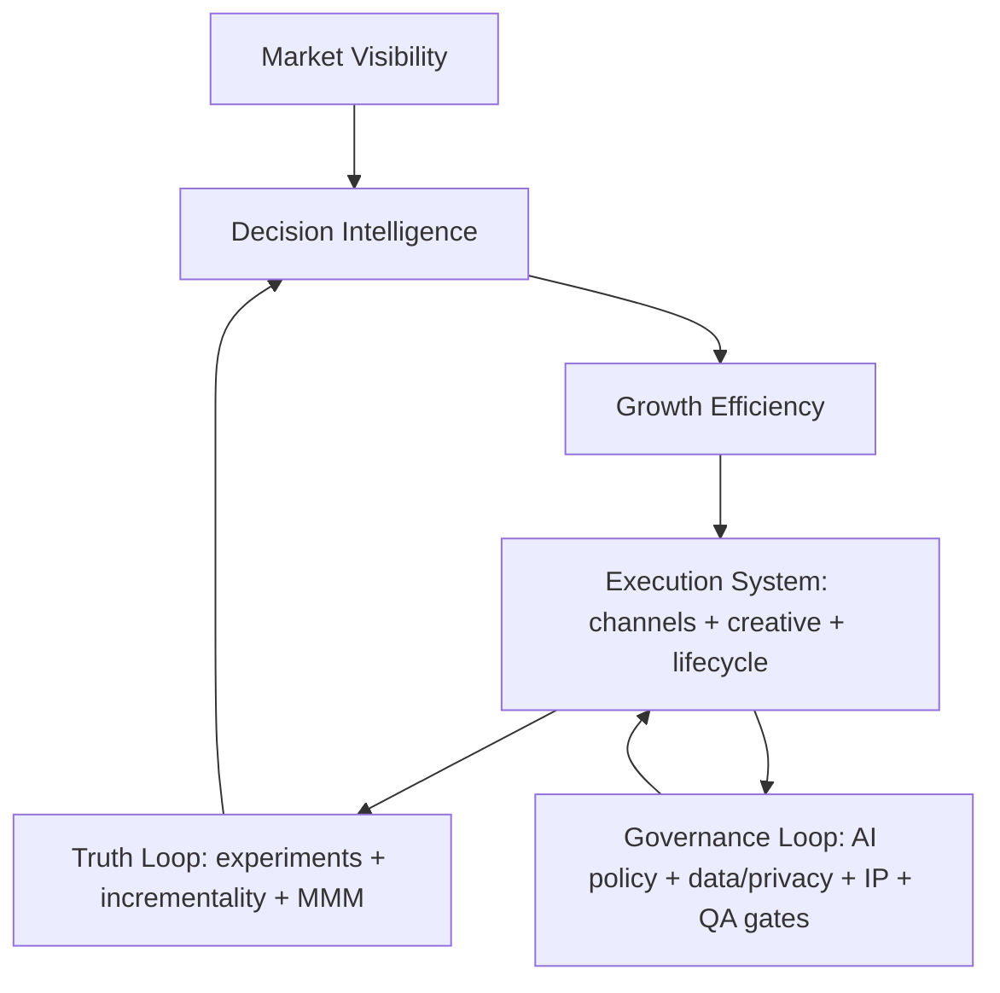
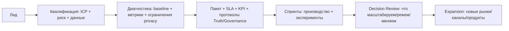

# Что добавить в подходы и позиционирование ViviDigit поверх текущего Strategic Messaging Framework с учётом рынка 2026 и влияния ИИ

## Executive summary

Ваш текущий фреймворк уже закрывает «стратегию → метод → масштаб → доверие» и хорошо попадает в тренд “human-led, AI-augmented”. Но в 2026 этого недостаточно, потому что рынок одновременно: (а) **требует доказуемости** (CFO‑pressure и “flat” бюджеты), (б) **перестраивает измерения и данные** (privacy, куки/идентификация, server-side), (в) **повышает требования к AI‑governance и IP‑рискам**, и (г) **коммодитизирует “низ” маркетинговых задач** через GenAI, оставляя премию тем, кто управляет качеством, безопасностью и причинно‑следственными эффектами.

Самые ценные дополнения к вашему позиционированию — это не новые красивые слова, а **два «жёстких слоя»**, которые превращают вашу «логика+интуиция» в покупаемую систему:

1) **Measurement Integrity Layer (“Causality & Proof”)** — обещание не «отчётов», а причинно‑следственного доказательства, что рост именно от ваших действий (инкрементальность, тест‑дизайн, MMM/эксперименты, единая «Truth‑модель» метрик). Это напрямую отвечает на “плоские бюджеты” и спрос на продуктивность. citeturn0search2turn3news41  
2) **AI Governance & Risk Layer (“Responsible AI, IP, Compliance”)** — правило игры для всего, что делает ИИ: данные, правообладание, ответственность, аудит, человеческий контроль, соответствие регуляторике. Это становится конкурентным преимуществом, потому что регуляторика формализуется (EU AI Act), а право на AI‑выходы ограничено, если нет человеческого авторства. citeturn1search1turn1search5turn1search2turn1news39turn1search3turn1search0  

Дополнительно стоит усилить позиционирование через «privacy‑resilient growth» (first‑party data, server‑side, CAPI), «enterprise-ready delivery» (procurement‑совместимость) и «AI value realization» (закрытие разрыва между “внедрили AI” и “получили прибыль”). citeturn2search1turn2search0turn2search2turn3search18  

## Рыночные факторы 2026, из‑за которых позиционирование нужно усилить

**Бюджеты и ожидания.** Средняя доля маркетингового бюджета как процента выручки у компаний в 2025 остаётся на уровне 7.7% (flat год‑к‑году), при этом от CMO ожидают повышения продуктивности и эффективности. Следствие: ваш “Strategic Engine” должен говорить языком CFO — не “мы сделали”, а “мы доказали инкремент и управляем риск‑профилем”. citeturn0search2  

**ИИ как дефлятор себестоимости маркетинга.** Крупные бренды уже публично ориентируются на существенное снижение стоимости производства маркетингового контента за счёт GenAI (пример: снижение на 30–50% в кейсе крупного FMCG‑бренда, как описывает Reuters). Это усиливает ценовое давление на агентства, которые продают «контент как товар», и одновременно повышает спрос на тех, кто продаёт *управляемую систему* (качество, governance, результат). citeturn0news38  

**Маркетплейсы фриланса — сигнал о “взрослении” рынка.** Публичные платформы сами демонстрируют смещение в «сложные, high‑value, AI‑native проекты»: одна из крупнейших площадок в отчёте за 2025 год подчёркивает upmarket‑сдвиг, рост spend per buyer и рост GMV из транзакций > $1,000, параллельно прогнозируя волатильность 2026 из‑за трансформации. Другая крупная платформа фиксирует интеграцию AI‑навыков в «обычную» работу (рост спроса на топ‑AI skills) и при этом говорит, что базовые категории работы не исчезают. Это прямо говорит: покупатели платят за сложность и надёжность поставки, а не за «штуки контента». citeturn3search9turn0search8turn3search4turn3search0  

**Измерение и данные стали “policy‑driven”.** С одной стороны, Apple‑уровень privacy (ATT) принуждает к opt‑in на трекинг; с другой — Chrome меняет архитектуру третьесторонних cookies в сторону “user choice”, что делает идентификацию и атрибуцию более хрупкими и вариативными по аудиториям/географиям. Это усиливает ценность first‑party data и server‑side измерений. citeturn2search1turn2search9turn2search0turn2search12turn2news38  

## Что в текущем фреймворке сильное и что объективно “не добито”

Ваши 4 слоя (Strategic Engine, Methodology, Geometry of Reach, Value Delivery) сильны тем, что:

- описывают **цепочку ценности** (visibility → intelligence → efficiency),
- чётко заявляют **человеческое лидерство** поверх AI,
- выделяют **кросс‑бордер сложность** как отдельную компетенцию,
- вводят **операционную надёжность** (productized + transparency + skin in the game).

Но в текущей версии есть три пробела, которые в 2026 рынок будет «штрафовать»:

**Пробел “Causality”:** фреймворк говорит про data и judgment, но не конфликтует напрямую с главным возражением клиента: “ваши метрики — корреляция, а не причинность”. При плоских бюджетах это критично. citeturn0search2  

**Пробел “Privacy‑resilience”:** вы говорите про AI‑speed и systems thinking, но не фиксируете, что рост должен быть устойчив к ограничениям идентификации (ATT, cookie choice) и должен жить на first‑party данных. citeturn2search1turn2search0turn2search2  

**Пробел “AI‑risk/IP/compliance”:** вы заявляете Safety & Trust, но без формальных опор на стандарты AI‑risk и без явного IP‑контура (кто владеет выходами, что с авторским правом, что допустимо публиковать). Это становится закупочным критерием, особенно в enterprise и в ЕС. citeturn1search1turn1search5turn1search2turn1news39turn1search3turn1search0  

## Что добавить в подходы и позиционирование: конкретные «слои» и как их встроить в ваши Pillars

Ниже — набор дополнений, каждое привязано к вашим текущим Pillars и сопровождается тем, *почему это нужно сейчас* и *как это превратить в продаваемый артефакт*.

### Таблица: “добавка” → куда встраивать → чем доказывать

| Что добавить (новый слой/акцент) | Куда встраивать в ваш фреймворк | Почему это становится must-have в 2026 | Что продаёте как артефакт (deliverables) |
|---|---|---|---|
| **Causality & Proof (“Truth Loop”)** | Pillar 1 (Decision Intelligence) + Pillar 4 (Transparency) | Бюджеты плоские, нужен доказуемый ROI и управление неопределённостью, иначе вас сравнят по цене с “контент‑командой” citeturn0search2 | Инкрементальность/эксперименты, дизайн тестов, единая модель KPI, «decision log», roadmap гипотез, MMM/байес‑подход где уместно (без обещаний «магии атрибуции») |
| **Privacy‑Resilient Growth (“First‑party by design”)** | Pillar 2 (Systems Thinking) + Pillar 3 (Global) | ATT и изменения по cookies делают клиентские метрики менее стабильными; ценность смещается к first‑party и server‑side citeturn2search1turn2search0turn2news38 | Архитектура событий/данных, server‑side tracking, consent‑flow, CRM/lifecycle связка, plan по “data portability” |
| **AI Governance & IP Safety (“Responsible AI”)** | Pillar 4 (Safety & Trust) | EU AI Act формализует требования; copyright на полностью AI‑созданные работы проблематичен; нужны процессы и ответственность citeturn1search1turn1search5turn1news39turn1search2 | AI‑policy, журналирование, human‑in‑the‑loop QA, правила датасетов/бренд‑гайды, IP‑карта “что кому принадлежит”, контуры допуска данных |
| **Standard‑to‑Enterprise Delivery (“Procurement-ready productization”)** | Pillar 4 (Operational Integrity) | Маркетплейсы сами “взрослеют” в managed services; чтобы быть дороже рынка, надо быть удобнее закупки и надёжнее поставки citeturn3search9turn0search8 | SLA, RACI, risk register, шаблоны MSA/DPA, security‑анкета, роли, escalation‑процедуры |
| **AI Value Realization (“from tools to outcomes”)** | Pillar 2 (AI‑Augmented) | Большинство компаний не извлекают значимую ценность от AI‑инвестиций; вы можете продавать “закрытие value gap” citeturn3search18turn3search2 | Обучение команды клиента, playbooks, внедрение рабочих контуров, KPI‑привязка, операционные метрики производительности |
| **Quality Signature (“anti‑slop позиция”)** | Pillar 4 (Predictable Excellence) | Качество и доверие становятся дефицитом на фоне удешевления генерации; поисковые системы прямо предупреждают о вреде “mass gen without value” citeturn2search11turn2search3 | Редакционный стандарт, факт‑чек, бренд‑контроль, библиотека “approved claims”, “quality gates” |
| **Cross-border compliance playbooks (не только язык)** | Pillar 3 (Global/Multi-local) | Глобальная экспансия — это legal/ads‑policy/данные/платёжки и локальная культурная адаптация, а не “перевод” | Маркет‑entry чек‑листы, карта ограничений, локальные офферы/UGC‑стратегии, compliance‑матрица по каналам |

### Как назвать эти дополнения, чтобы не раздувать позиционирование

Вместо “Pillar 5/6” лучше ввести **два «кольца» вокруг вашего текущего ядра**:

- **Truth Loop (Доказуемость)** — про причинность и повторяемость результата.  
- **Governance Loop (Управляемые риски)** — про ИИ, данные, IP, безопасность, глобальные регуляторные ограничения.

Это усиливает ваши слова “Predictable Excellence”: предсказуемость приходит либо через доказуемость (Truth), либо через контроль рисков (Governance).

### Mermaid: как выглядит система после добавления Truth + Governance



## Как усилить тексты и «голос бренда»: что говорить, кому и какими формулировками

Ниже — не “копирайт ради копирайта”, а конкретные месседжи, которые отражают реальность рынка и закрывают типовые возражения.

**Новый «главный конфликт» (problem framing).**  
“В эпоху GenAI скорость стала дешёвой. Дорогими стали причинность, качество и доверие.” Это логически обосновано тем, что GenAI измеримо повышает продуктивность для ряда задач и ролей, но эффект неоднороден (сильнее помогает новичкам/задачам средней сложности) — поэтому ценность смещается к дизайну процесса и контролю качества. citeturn4search0turn4search3turn0search3  

**Сообщение для CEO:**  
“Мы строим операционную систему роста, а не набор активностей. Скорость даёт ИИ, устойчивость даёт система.”  
Подкрепление: большинство компаний испытывает разрыв между инвестициями в AI и реальной ценностью; вы продаёте закрытие этого разрыва. citeturn3search18  

**Сообщение для CFO:**  
“Мы не обещаем ‘атрибуцию’, мы обещаем доказуемость: тест‑дизайн, инкрементальность и прозрачный decision-log.”  
Подкрепление: плоские бюджеты и рост требований к эффективности. citeturn0search2  

**Сообщение для CMO/Head of Growth:**  
“Мы делаем рост privacy‑resilient: first‑party данные, server‑side, и измерения, которые переживают изменения в идентификации.”  
Подкрепление: ATT и изменения подходов к third‑party cookies/выбору пользователя. citeturn2search1turn2search0turn2news38  

**Сообщение для Legal/Procurement:**  
“Наш ‘Safety & Trust’ — это не декларация. Это стандарт: AI‑policy, IP‑контур, журналирование, человеческий контроль, и привязка к международным рамкам управления рисками.”  
Подкрепление: NIST AI RMF как ориентир risk management, ISO/IEC 42001 как стандарт AI management system, и формализация требований в ЕС через EU AI Act. citeturn1search3turn1search7turn1search0turn1search1turn1search5  

**Что добавить в ваш “Value Delivery” язык.**  
Сейчас у вас есть Radical Openness, SOPs и Skin in the game. Добавьте три “необсуждаемых” компонента, которые покупают зрелые клиенты:

- **Prove:** “Каждому решению — тест или логическое доказательство; каждому спринту — гипотезы и журнал решений.” citeturn0search2  
- **Protect:** “Никаких ‘чёрных ящиков’: управляемые модели, управляемые данные, управляемые права.” citeturn1search2turn1news39turn1search6  
- **Port:** “Данные и процессы переносимы: вы не становитесь заложником ни нас, ни платформ.” (Это особенно сильно на фоне platform‑risk и privacy‑дрейфа.) citeturn2search0turn2search1  

## Как внедрить изменения без расползания продукта

Чтобы это не стало «ещё одной презентацией», вот минимальная практическая имплементация на 30–60 дней.

**Сделайте два новых “протокола”, встроенных в VIVI Protocol:**

1) **Truth Protocol (Measurement Integrity)**  
   - шаблон “North Star + input metrics + guardrails”;  
   - шаблон эксперимента (гипотеза → дизайн → критерий успеха → риск → решение);  
   - monthly “Decision Review” вместо классического “отчёта по метрикам”.

2) **AI & IP Protocol (Responsible AI)**  
   - политики: что можно/нельзя загружать в модели, хранение, доступы;  
   - требования human‑review для всех внешних материалов;  
   - правила авторского права: фиксация человеческого вклада (потому что право на чисто AI‑выходы ограничено, и это юридически подтверждается практикой и позициями регуляторов/судов). citeturn1search2turn1news39turn1search6  

**Соберите “Enterprise-ready пакет” даже если вы пока SMB/mid-market.**  
Это парадоксально ускоряет продажи: SLA, RACI, DPA‑шаблон, ответы на security‑вопросы. Это соответствует тренду: платформы и рынок движутся к managed, высокоценовым, более формализованным поставкам. citeturn3search9turn0search8  

**Упакуйте предложение в три листа (не в 40‑страничный deck):**
- “What we prove” (Truth Loop)  
- “What we protect” (Governance Loop)  
- “What we ship” (Productized factory)

### Mermaid: клиентский поток с учётом новых слоёв



## Ключевые источники

```text
Gartner: marketing budgets flat at 7.7% of revenue (2025 CMO Spend Survey press release)
https://www.gartner.com/en/newsroom/press-releases/2025-05-12-gartner-2025-cmo-spend-survey-reveals-marketing-budgets-have-flatlined-at-seven-percent-of-overall-company-revenue

McKinsey: genAI can raise marketing productivity 5–15% of spend (~$463B)
https://www.mckinsey.com/capabilities/growth-marketing-and-sales/our-insights/how-generative-ai-can-boost-consumer-marketing

Apple: App Tracking Transparency (user explanation + developer requirements)
https://support.apple.com/en-us/102420
https://developer.apple.com/news/?id=ecvrtzt2

Google: Privacy Sandbox updates + Reuters on cookie plan reversal
https://privacysandbox.google.com/blog/update-on-plans-for-privacy-sandbox-technologies
https://www.reuters.com/technology/google-scraps-plan-remove-cookies-chrome-2024-07-22/

Meta: Conversions API overview
https://www.facebook.com/business/tools/conversions-api

EU AI Act: Regulation (EU) 2024/1689 + EC note
https://eur-lex.europa.eu/eli/reg/2024/1689/oj/eng
https://commission.europa.eu/news-and-media/news/ai-act-enters-force-2024-08-01_en

NIST AI RMF 1.0
https://www.nist.gov/itl/ai-risk-management-framework
https://nvlpubs.nist.gov/nistpubs/ai/nist.ai.100-1.pdf

ISO/IEC 42001:2023 AI management systems
https://www.iso.org/standard/42001.html

US Copyright Office: AI guidance (Federal Register) + AI report part 2
https://www.federalregister.gov/documents/2023/03/16/2023-05321/copyright-registration-guidance-works-containing-material-generated-by-artificial-intelligence
https://www.copyright.gov/newsnet/2025/1060.html

Upwork: In-Demand Skills 2026 (AI skills growth)
https://investors.upwork.com/news-releases/news-release-details/upworks-demand-skills-2026-demand-top-ai-skills-more-doubles-ai
https://www.upwork.com/research/in-demand-skills-2026

Fiverr: FY2025 results + 2026 guidance and pivot to high-value/AI-native
https://www.fiverr.com/news/fiverr-q4-earnings-2025
https://investors.fiverr.com/news-releases/news-release-details/fiverr-announces-fourth-quarter-and-full-year-2025-results

Academic evidence: productivity effects of genAI
https://www.nber.org/papers/w31161
https://economics.mit.edu/sites/default/files/inline-files/Noy_Zhang_1.pdf
```